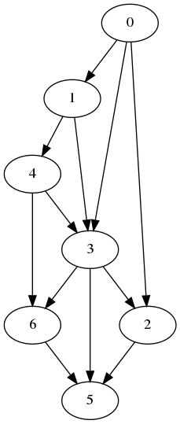

P.S. 用到的图数据出自《数据结构与算法分析 C 语言描述》一书

各顶点的分布如下所示

但是将数据用 `dot` 软件可视化之后图的形状变了

```
           0             1


2                  3                  4


           5              6
```

- graph

  

- topsort_graph

  

- unweighted_graph

  
